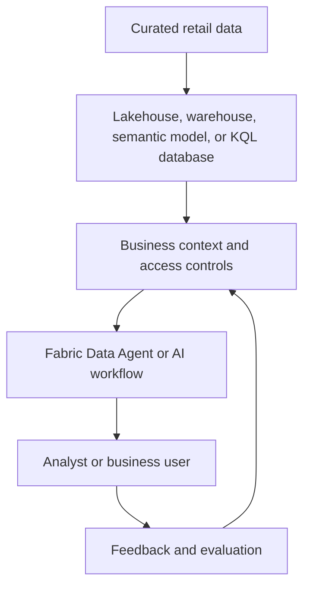

# AI and Data Agent readiness

Fabric can support AI workflows when data is discoverable, well defined, and protected. The source demo introduces Azure OpenAI, LangChain, SynapseML, machine learning examples, and Fabric Data Agent as ways to explore data through models and natural-language interactions.

## Capability map

| Capability | Learning purpose | Production question |
| --- | --- | --- |
| Azure OpenAI and LangChain | Explore model calls, prompting, and text transformations. | How are identities, secrets, model deployments, and content controls governed? |
| SynapseML | Apply scalable ML and model-serving patterns to data. | Which evaluation, monitoring, and lifecycle controls govern the model? |
| Fabric Data Agent | Ask questions over approved Fabric data sources. | Which data sources, instructions, users, and actions are appropriate? |
| Power BI Copilot experiences | Support analytical exploration from governed semantic models. | Are the semantic model, tenant settings, and user permissions ready? |

## Data Agent readiness checklist

- Confirm the required tenant setting and current preview or feature eligibility in the official documentation.
- Use a workspace assigned to suitable Fabric capacity and supply at least one supported, populated data source.
- Restrict the agent's data scope to approved tables, models, or databases; do not assume a natural-language layer changes underlying permissions.
- Create representative retail questions, expected answers, and review criteria before exposing the experience to broader users.
- Keep sensitive data, harmful prompts, overbroad instructions, and unsupported actions out of the initial pilot.

!!! warning
    Data Agent and connected AI features can be preview or capacity-dependent. Verify current prerequisites and limitations in [Fabric Data Agent documentation](https://learn.microsoft.com/fabric/data-science/how-to-create-data-agent) before implementation.

## Explore further

- [AI and LLM source guide](https://github.com/Cloud2BR-MSFTLearningHub/Fabric-AI-Retail-Demo/blob/main/AzurePortal/2_AI_LLMs/README.md)
- [Sample Fabric LLM notebook](https://github.com/Cloud2BR-MSFTLearningHub/Fabric-AI-Retail-Demo/blob/main/AzurePortal/2_AI_LLMs/src/fabric-llms-overview_sample.ipynb)
- [Data Agent source guide](https://github.com/Cloud2BR-MSFTLearningHub/Fabric-AI-Retail-Demo/blob/main/AzurePortal/3_DataAgent.md)