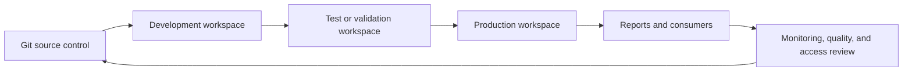

# Govern and operate

Fabric becomes a durable retail platform when data, workspaces, semantic models, and deployment practices are operated as a connected system. The source material includes Power BI access and refresh guidance, GitHub integration, and deployment-pipeline examples.

## Operating controls

| Area | Practice |
| --- | --- |
| Workspace access | Use least privilege, separate administrative and consumption roles, and review access regularly. |
| Data governance | Document business definitions, classify sensitive retail data, define ownership, and monitor data quality. |
| Power BI | Align semantic-model permissions, refresh ownership, incremental refresh policy, and report distribution to business requirements. |
| DevOps | Version workspace artifacts, validate changes before promotion, and use controlled deployment pipelines. |
| Cost and capacity | Monitor capacity consumption, schedule non-production use where possible, and set ownership for capacity decisions. |

## Delivery path

1. Connect a development workspace to source control and define the artifacts that should move together.
2. Validate data quality, security, refresh, and semantic-model changes before promotion.
3. Use deployment pipelines or an equivalent release process to move through environments intentionally.
4. Monitor capacity utilization, refresh failures, data-quality signals, and report behavior after deployment.
5. Keep recovery, rollback, and business-owner communication steps in the release process.

!!! note
    A pipeline moves artifacts; it does not replace data-governance, security, or business validation. Keep environment-specific connections, credentials, and access assignments under explicit control.

## Source guides

- [Deployment pipelines](https://github.com/Cloud2BR-MSFTLearningHub/Fabric-AI-Retail-Demo/tree/main/AzurePortal/4_DevOps/0_deployment-pipelines)
- [GitHub integration](https://github.com/Cloud2BR-MSFTLearningHub/Fabric-AI-Retail-Demo/blob/main/AzurePortal/4_DevOps/1_github-integration.md)
- [Power BI guidance](https://github.com/Cloud2BR-MSFTLearningHub/Fabric-AI-Retail-Demo/tree/main/_PowerBi)