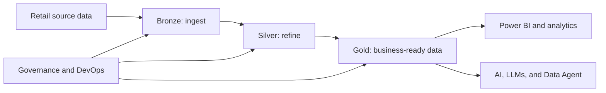

# Fabric AI Retail Demo

This learning hub shows how Microsoft Fabric can provide a unified retail data foundation and prepare governed data for future AI-driven scenarios. The source demo combines a medallion architecture, Fabric capacity and workspace setup, Azure OpenAI and LLM experimentation, Data Agent, Power BI, and deployment practices.

!!! warning
    This is a community learning demo. Validate Fabric licensing, capacity sizing, costs, regional availability, tenant settings, security, data governance, and production deployment requirements before using these patterns in a real retail workload.

  <a class="guide-card" href="retail-data-foundation/"><strong>Retail data foundation</strong>Use the medallion pattern to turn raw retail files into curated business data.</a>
  <a class="guide-card" href="ai-and-data-agent/"><strong>AI and Data Agent readiness</strong>Learn how governed lakehouse, warehouse, and semantic-model data can support AI experiences.</a>
  <a class="guide-card" href="provision-the-demo/"><strong>Provision the demo</strong>Choose portal or Terraform setup and review capacity, cost, access, and network assumptions first.</a>
  <a class="guide-card" href="govern-and-operate/"><strong>Govern and operate</strong>Connect workspace access, Power BI, Git integration, and deployment pipelines to repeatable delivery.</a>

## Start here

| Need | Start with |
| --- | --- |
| Understand the data journey | [Retail data foundation](retail-data-foundation.md) |
| Explore AI-enabled analytics safely | [AI and Data Agent readiness](ai-and-data-agent.md) |
| Create a learning environment | [Provision the demo](provision-the-demo.md) |
| Promote work through governed environments | [Govern and operate](govern-and-operate.md) |

## Demo source paths

- [Workshop overview](https://github.com/Cloud2BR-MSFTLearningHub/Fabric-AI-Retail-Demo/blob/main/README.md)
- [Medallion Architecture](https://github.com/Cloud2BR-MSFTLearningHub/Fabric-AI-Retail-Demo/tree/main/AzurePortal/1_MedallionArch)
- [AI and LLM notebooks](https://github.com/Cloud2BR-MSFTLearningHub/Fabric-AI-Retail-Demo/tree/main/AzurePortal/2_AI_LLMs)
- [Data Agent walkthrough](https://github.com/Cloud2BR-MSFTLearningHub/Fabric-AI-Retail-Demo/blob/main/AzurePortal/3_DataAgent.md)
- [Terraform deployment](https://github.com/Cloud2BR-MSFTLearningHub/Fabric-AI-Retail-Demo/tree/main/Terraform)
- [Power BI guidance](https://github.com/Cloud2BR-MSFTLearningHub/Fabric-AI-Retail-Demo/tree/main/_PowerBi)