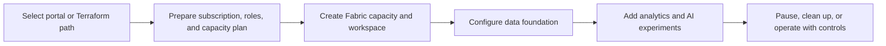

# Provision the demo

The demo supports two setup paths. Use the Azure portal path for a guided workshop experience, or Terraform when you need a repeatable learning environment with reviewed configuration.

!!! danger
    The Terraform demonstration provisions a Fabric capacity, storage, SQL Server, and SQL database. Its source description references a public-network SQL setup and an F64 Fabric capacity example. Treat this as a learning starting point, not a production baseline; review cost, data protection, private networking, identity, and least-privilege requirements before applying.



## Choose a deployment path

| Path | When it fits | Source guide |
| --- | --- | --- |
| Azure portal | Guided learning or a one-off workshop where each resource is created visibly. | [Azure Portal walkthrough](https://github.com/Cloud2BR-MSFTLearningHub/Fabric-AI-Retail-Demo/tree/main/AzurePortal) |
| Terraform | Repeatable environment setup, peer review, and source-controlled infrastructure definitions. | [Terraform guide](https://github.com/Cloud2BR-MSFTLearningHub/Fabric-AI-Retail-Demo/tree/main/Terraform) |

## Terraform deployment sequence

```sh
cd Terraform/src
az login
terraform init
terraform plan -var-file terraform.tfvars
terraform apply -var-file terraform.tfvars
```

The current Terraform source creates a resource group, storage account/container, SQL Server/database, Fabric capacity, and Fabric workspace. It obtains the current client identity and makes that identity or configured UPNs capacity administrators.

## Pre-flight checks

- Confirm you have a suitable Azure subscription, Fabric licensing/capacity plan, and the necessary tenant permissions.
- Review the exact capacity SKU, region availability, administrator identities, and all resource names in `terraform.tfvars`.
- Do not commit environment-specific secrets or values. Use an approved secret-management and CI/CD strategy for real deployments.
- Review network exposure, firewall, private endpoint, backup, retention, monitoring, and cost controls before connecting retail data.
- Plan the shutdown or deletion path before the workshop begins; pause or remove billable capacity when it is no longer needed.

## Cleanup

```sh
terraform destroy -var-file terraform.tfvars
```

Review resource dependencies and data retention requirements before destroying anything. See the source [Terraform troubleshooting guide](https://github.com/Cloud2BR-MSFTLearningHub/Fabric-AI-Retail-Demo/blob/main/Terraform/troubleshooting.md) for deployment-specific help.