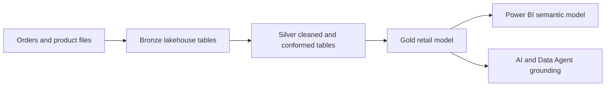

# Retail data foundation

The source demo uses a medallion architecture to make retail data progressively more useful: ingest source files into Bronze, standardize and validate them in Silver, then publish curated Gold data for reporting and AI scenarios.

## What each layer should accomplish

| Layer | Retail responsibility | Typical control |
| --- | --- | --- |
| Bronze | Preserve raw orders and product source data with traceability. | Capture source, ingestion time, schema, and file or batch identifier. |
| Silver | Clean data, standardize types, handle quality issues, and join compatible entities. | Validate keys, deduplicate, quarantine bad records, and document transformations. |
| Gold | Publish stable business entities and metrics for consumption. | Apply business definitions, access controls, and quality checks. |

## Source learning artifacts

The demo includes sample order and product files plus notebooks for [Bronze-to-Silver](https://github.com/Cloud2BR-MSFTLearningHub/Fabric-AI-Retail-Demo/blob/main/AzurePortal/1_MedallionArch/src/0_notebook_bronze_to_silver.ipynb) and [Silver-to-Gold](https://github.com/Cloud2BR-MSFTLearningHub/Fabric-AI-Retail-Demo/blob/main/AzurePortal/1_MedallionArch/src/1_notebook_silver_to_gold.ipynb) processing. The original [Medallion Architecture guide](https://github.com/Cloud2BR-MSFTLearningHub/Fabric-AI-Retail-Demo/tree/main/AzurePortal/1_MedallionArch) remains the detailed walkthrough.

!!! tip
    Start AI work from Gold data that has named owners, clear definitions, sufficient quality checks, and appropriate access boundaries. Curated data is safer and easier to explain than ad hoc raw inputs.

## Retail decisions to make early

- Define the grain and refresh expectation of orders, products, inventory, and customer-related entities.
- Decide which identifiers are sensitive or linkable, then implement classification and access restrictions before broad sharing.
- Keep transformation logic versioned and testable so business definitions remain consistent in reports and AI responses.
- Design incremental processing and data-quality monitoring before data volume makes reprocessing expensive.